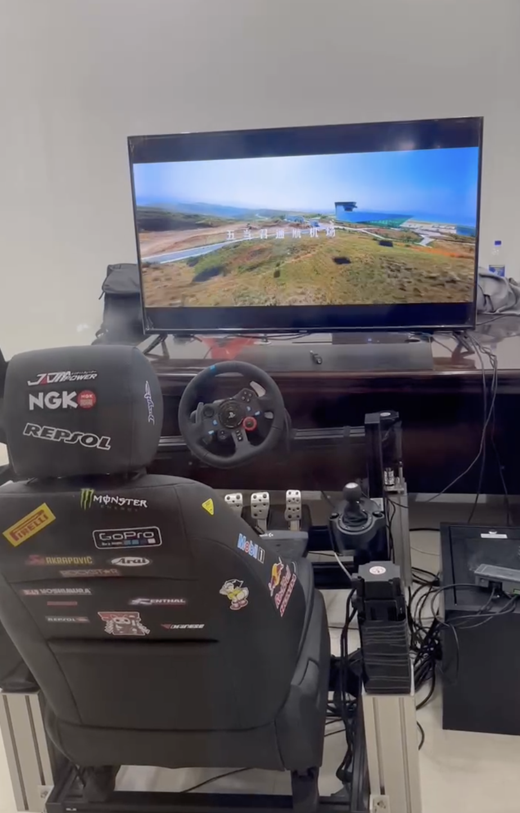
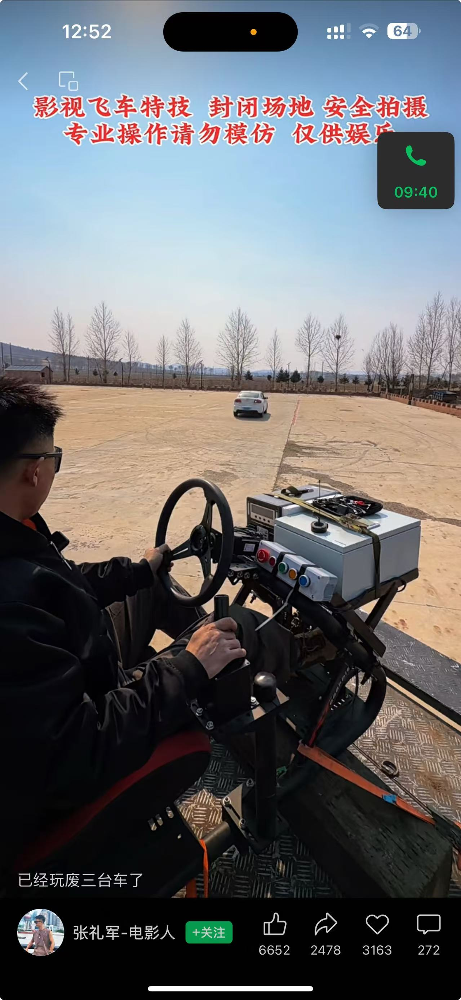
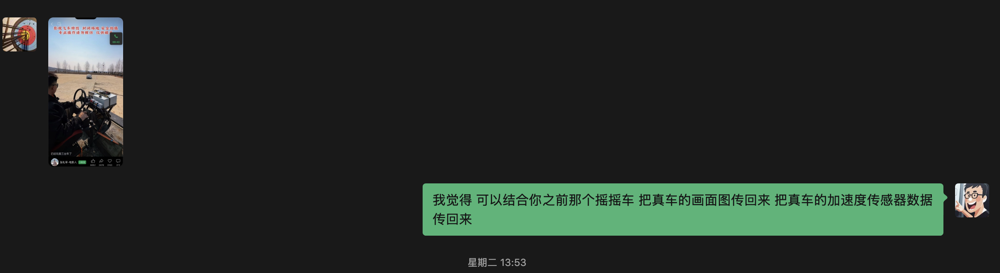

# 32_远程遥控系统 (TelePilot System)

## 1. 产品简介
本项目致力于开发一套完整的**全链路实车远控系统 (End-to-End Real-car Teleoperation System)**。该系统不仅包含室内的**沉浸式远控驾舱 (Tele-Cockpit)**，还包括一套高度集成的**车载改装套件 (Vehicle Actuation Kit)**。

通过高带宽、低延迟的通信链路，系统将专业动感模拟器与室外真实车辆深度整合，实现“人机分离、感官同步”的操控体验。

### 系统构成
1. **沉浸式远控驾舱 (Tele-Cockpit)**：
   - 专业铝型材支架与动感电缸底座。
   - 高精度力反馈方向盘及液压踏板。
   - 实时物理数据反馈处理单元，将真车 G-Force 转化为座舱动态。

2. **车载改装套件 (Vehicle Actuation Kit)**：
   - **控制总成 (Main Controller)**：高度集成的车载控制箱，支持 4G/5G/专用电台。
   - **执行机构 (Actuators)**：高扭矩转向马达、线控刹车执行器、电子油门转换器。
   - **感官采集 (Sensory Suite)**：IMU 惯性传感器、多路低延迟 4K 摄像头。
   - **快装支架 (Quick-mount Rig)**：支持对民用及特种车辆的快速无损改装。

### 核心特性
- **双向物理闭环**：不仅能发指令，还能回传“手感”与“体感”。通过车载 IMU 采集真车的加速度、倾斜度、颠簸感，并由座舱动感底座实时还原。
- **超低延迟链路**：针对跨区域操控优化的图传与指令协议，确保毫秒级响应。
- **协议兼容性**：支持标准 CAN-bus 协议，可深度接管支持线控底盘的车辆，亦支持通过机械手控制传统机械车辆。

## 2. 关键图像
| 室内操作端 | 室外实车端 | 核心构思 |
| :---: | :---: | :---: |
|  |  |  |

## 3. 应用市场方向
1. **影视特技拍摄**：替代特技演员在危险场景（撞车、爆炸）中驾驶真车，保障人员安全。
2. **高危工业作业**：矿区采掘、抢险救灾、核污染区等无人化设备控制。
3. **港口物流接管**：针对自动化码头 AGV 或重卡的紧急人工介入接管。
4. **国际人道主义扫雷**：在冲突地区（如乌克兰）实现远程精准扫雷，通过感官回传提高判别精度。
5. **老龄化替代方案**：在日本等国家，通过远程座舱让高龄熟练技工继续发挥余热。

## 4. 迷雾测试 (Smoke Test) 计划
为了验证市场渴望程度 (Market Desirability)，计划执行以下精益验证：
1. **网站建设**：基于 Vercel 部署产品展示页 (TelePilot.io)，整合 Google Analytics。
2. **SEO 与内容策略**：发布 3 篇针对垂直领域（矿山、影视、扫雷）的技术解决方案文章。
3. **转化设置**：设置“索取技术规格书”按钮，统计高价值用户留资情况。
4. **信任背书**：在 GitHub 开源通信协议标准及模拟器插件代码。
5. **社交矩阵**：通过 LinkedIn 及行业论坛进行精准导流。

---
*Created by Accio AI Assistant on 2026-04-23*
